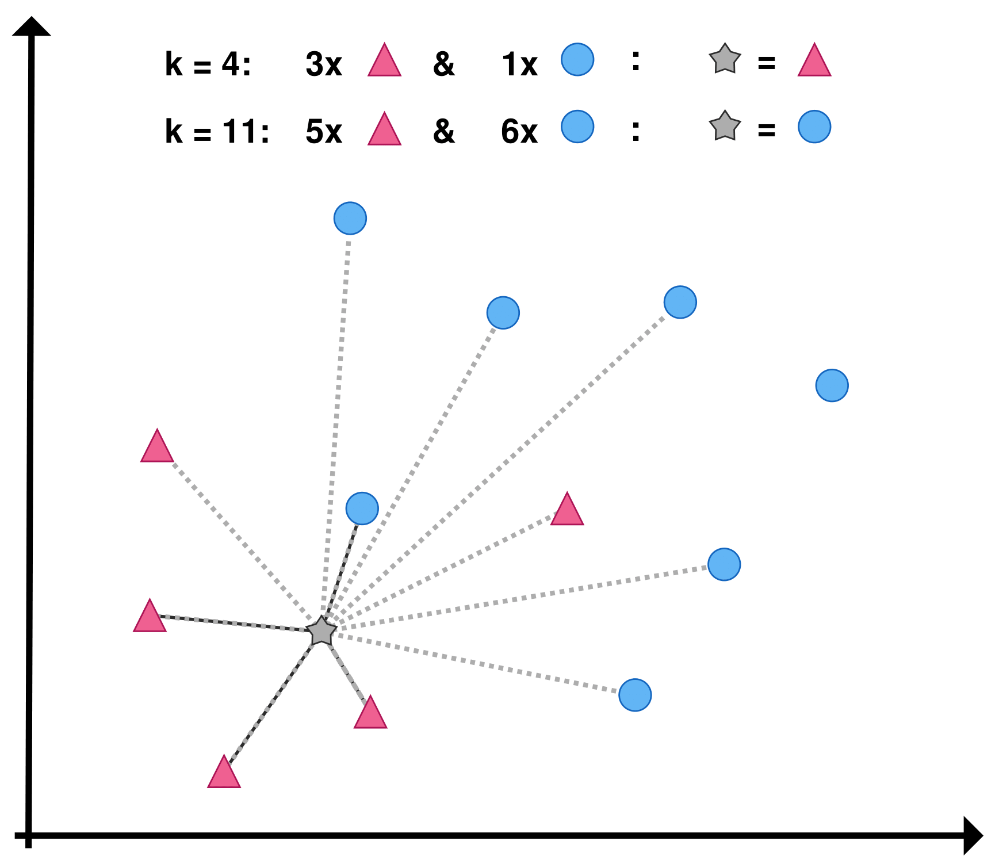
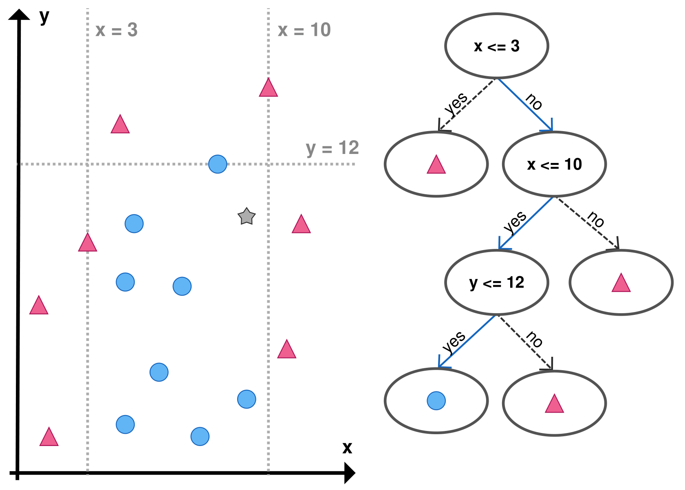

# Machine Learning Introduction
## A Short Introduction to the used Algorithms

_Machine Learning_, _Artificial Intelligence_ and _Deep Learning_ have been prominently used buzzwords over the last decade. Concurrently, the differences between these terms have blurred and they sometimes have been used synonymously. 

Before we go into detail about specific algorithms and their respective strengths and drawbacks as well as their recommended field of application, we would like to define these general terms and give an understanding of what are realistic goals and expectations when working with these advanced algorithms.

The _Singapore Computer Society_ defines Artificial Intelligence (abbr. **AI**) as "the development of smart systems and machines that can carry out tasks that typically require human intelligence"[^1]. AI is a more abstract concept and can combine multiple problem-solving mechanisms within one system. Machine Learning (abbr. **ML**) algorithms hence are a subsection of an AI system and can draw conclusions and new information from data as well as make decisions based on previously observed and learned patterns. The field of ML algorithms then further splits into _Deep Learning_ (abbr. **DL**) and _Shallow Learning_, although the latter is usually just referenced by the general term of Machine Learning. The main difference here is that in foundational Machine Learning, the features, i.e. the data columns, have to be pre-defined by the user. In Deep Learning the system, typically a complex artificial neural network, will autonomously select the features to determine an outcome. Examples of this are image processing tasks, where a neural network is presented with a plethora of pictures of cats and needs to extract and conclude what "a cat is made of" to identify one in a picture. (Shallow) ML algorithms, on the other hand, can only operate on fixed features, such as "height", "weight", "has whiskers" or "fur color" for a possible prediction. If the training data set already has labels, such as _cat_ or _dog_ in this example, i.e. the resulting possible outcomes are already defined, the algorithms used are called _supervised learning algorithms_. In the case of an unknown distribution of labels or groups in the data _unsupervised learning algorithms_ separate the data set into partitions, placing "similar" data points into one group, then called a cluster, and maximizing the difference between data points in different groups. 

A simplified overview of the relations of all these terms is depicted here:

## Supervised Learning Algorithms 
In (Shallow) Machine Learning, supervised learning algorithms describe a paradigm that requires labeled data as input to generalize and summarize, hence _learn_ from. The so-called labels represent the groups or categories the data should be separated into and that are of interest to the user. The algorithms then use various steps of calculations to _learn_ how to differentiate the given groups. This means, that the dataset that is used to train the algorithm, the so-called _train set_, needs to be carefully and diligently selected and manually labeled by experts to maximize the effectiveness of the following predictions. Having learned what features or measurements most contribute to the affiliation of a data point to a certain group, the algorithm can then categorize and sort unknown data into the learned groups. 

Many supervised learning algorithms are mathematically easy to understand and can already give promising results in these classification tasks at hand.

In the following subsections, a selection of commonly used supervised learning algorithms will be explained and tested on our use-case of identifying and predicting the sex of sheep given only the measurements of their skeletal remains.

### $k$-Nearest Neighbors
The $k$-nearest neighbor algorithm (abbr. $k$NN) is a very straightforward supervised learning algorithm but oftentimes strikingly effective in terms of classifying data with only a small number of possible groups and a relatively small data set. As both of these descriptions are accurate for this specific case, this algorithm is an evident first pick. The main idea of the algorithm can be summarized as the following: Given a set of labeled data points in a $n$-dimensional space, the new point is classified by calculating the spatial distance to every other point in the set using a Euclidean distance function. 
The Euclidean distance in $n$-dimensional space is defined as the square root of the sum of all pairwise subtracted squares: 
$$
\sqrt{\sum_{i=1}^{n} (p_i - q_i)^2}
$$
where $p$ and $q$ is the pair of points and $n$ the dimensionality of the data set. 

The name-giving parameter $k$ then determines how many "neighbors", i.e. spatially closest points, are to be considered. The most prominently present label in this neighboring subset of data points determines the label of the new point. A graphical example is given in the Figure below. The data set consists of a total of 12 points, 5 labeled as class _pink_ (triangle) and 7 labeled as _blue_ (circle). The new point (grey star) has to be classified as one of these two classes. When parameter $k$ is chosen to be $4$, the point would be classified as _pink_, because out of its $4$ nearest neighbors, $3$ of them are part of the class _pink_. If $k$ is set to $11$, the _blue_ class has the majority of the $11$ neighbors and the point would be assigned to the _blue_ class.

$k$NN is an algorithm with strengths in its simplicity and robustness, especially in very small data sets. Its only parameter $k$, needs to be chosen concerning the size of the already labeled training set. When $k$ is set too small, the algorithm becomes prone to outliers and might misclassify the new data points. When $k$ is chosen to be big, the algorithm loses its effectiveness as simply the majority of the label in the data set is always chosen as the predicted association. Another drawback of $k$NN is its limitation in the number of dimensions and the number of labels or groups. As Euclidean distance differences vanish in high dimensionality (this is one aspect of the effects of the so-called _curse of dimensionality_), accurately localizing one point's neighbors gets harder in a high dimensional space. With a high number of different labels, i.e. classes to divide the data set in, a similar problem arises, as multiple groups might be present most prominently in the neighboring points, resulting in a random pick by the algorithm.

### Support Vector Machine

Support Vector Machine, or SVM for short, is a well-established choice for linearly separable classification tasks. The SVM algorithm divides a labeled data set into groups by drawing (hyper)planes in such a way, that all points from one category are placed on one side of the plane, while all other points are on the opposite side. By solving the so-called _Convex Optimization Problem_ SVMs choose the optimal hyperplane from all possible solutions, meaning the distance between all points and the separating plane is maximized. In $2$-dimensional space, this hyperplane is simply a dividing line, as seen in the Figure below. All points from the _pink_ class are on one side of the separating line and all points belonging to the _blue_ class are on the other. Depending on the features of the new point (grey star), it is placed on either side of the separating line and therefore associated with the corresponding class, here labeled as _pink_. Afterward, the line can optionally be recalculated and moved slightly to the new optimal separating line.

SVMs require no parameter input from the user, so they are easy to use and the results are self-evident and straightforward to interpret. They work efficiently on small to medium datasets. Their main drawback is that real-world data is rarely purely linearly separable, i.e. divisible with a straight line. While there are possible solutions and workarounds (see the _Kernel Trick_ for example), when working on a higher dimensional or a non-linearly separable dataset, other classifying methods such as Neural Networks (see later) have been proven more efficient. 

### Decision Trees
Decision Trees (abbr. DT) are a classification method that utilizes _Binary Tree_ structures to illustrate and quantify the decision process of assigning class labels to data points. Given a labeled dataset, the algorithm recursively splits the data set until each partition only consists of data points belonging to the same class. The number of splits, or decisions, is decided by the user and is represented by the depth of the tree. A visual representation of a Decision Tree comprises two different kinds of \textit{nodes}, the _Decision Nodes_ and the _Leaf Nodes_. Decision nodes represent the branching point in the tree and contain the condition and information where the data is split. The leaf nodes mark the end of each "branch'' in the tree and represent the class labels assigned to all data points satisfying the preceding conditions. A graphical example of a $2$-dimensional data set (left) and the corresponding decision tree (right) is given in the Figure below. The tree is constructed by iteratively calculating the homogeneity, i.e. the _entropy_, of the remaining data set at each branch node. Whenever one split divides the set in a way that there is a homogeneous partition (only data points of one class lead to an _entropy_ value of $0$), a leaf node is formed. 

When constructed, classifying new data is straightforward. Following the split conditions, the new data sample traverses through the decision tree and is labeled with the class of the corresponding resulting leaf node. In our example in the Figure below, the grey star follows the solid blue path and is sorted into the _blue_ class.

In contrast to SVMs, decision trees can classify non-linearly separable data sets but are prone to _overfitting_. Overfitting is a term often used in Machine Learning, when the algorithms fail to generalize from the data set and "over-memorize'' the training set, resulting in bad classification results when tested on new data. When choosing the depth of a tree, i.e. the number of decisions to make before assigning a class label, the trade-off between the best representation of the training data and a generalizing model has to be carefully selected.

Another advantage of a constructed Decision Tree is the insight into which feature or attribute is most relevant for deciding how data points are classified. This information can be beneficial when aiming for a deeper analysis of the different features and how each of them individually contributes to the classification. 

### Neural Networks
Artificial Neural Networks (abbr. (A)NN) have been the recent go-to method whenever faced with a relatively complex task. Additional adaptations established these network models as the base of the most powerful computational problem solvers, like image or speech recognition as well as large language models like _ChatGPT_. Based on the human brain structure, neural networks consist of interconnected artificial neurons, arranged in layers - one input layer, a number of so-called _hidden layers_, and an output layer. Each neuron can hold an associated weight and a threshold value. When that threshold value is exceeded, the neuron is "activated'' and sends data to the next layer of the network, contributing to the process of identifying certain criteria needed for classification. Figuratively speaking, each neuron becomes !responsible'' for identifying a specific feature of the data and passes on its information to the next layer when activated and will not react if that specific feature is not present. The output layer then combines all passed-through information and concludes the classification process.

As previously stated, neural networks can be very powerful for classification, especially when it is not possible to manually identify the needed features, for example in image recognition. The flip side of this ability is the higher amount of training data needed to extract representative features for the data. In our example, the features and attributes of our data are clearly defined but because of its pervasive application in Machine Learning, ANNs will be included in this study.

## Unsupervised Learning
While supervised learning focuses on understanding the relationship between labeled data and its distribution, unsupervised learning aims to closely model the distribution of data itself, without relying on predefined labels. This distribution could be of a singular form, like a normal distribution, or a combination of multiple distributions forming the dataset. Identifying groups, that are similar within themselves but distinct from instances in other groups, is referred to as clustering. Various algorithms exist for discovering clusters within data, with the most common categories being partitioning and density-based.

### $k$-Means
$k$-Means is arguably the most well-known clustering algorithm and is used for partitioning data points into $k$ distinct groups. It starts out by randomly picking $k$ cluster centers, the _centroids_. Each data point is then iteratively assigned to the nearest centroid and after assigning all data points in the set, the centroids are updated to the mean value of all points assigned to that cluster. This process continues until the centroids no longer change significantly or a predefined number of iterations is reached, resulting in clusters that minimize the sum of squared distances from each point to its assigned centroid.

$k$-Means simple nature is also its biggest back draw. Because its clusters are represented by only one cluster center, $k$-Means works very well on spherical clusters. Our data however is more line-shaped and linear correlated, leading to sub-optimal results. Additionally, the outcome of a clustering is highly dependant on its initial choice of centroids. A "bad'' initialisation of a $k$-Means algorithm can get the algorithm stuck in a so-called _local optimum_, which does not concur with the global distribution of the points. Outliers, i.e. points, that significantly differ from other observations, have a big impact on the clustering process, as they can potentially skew and distort the resulting clusters. To solve these potential concerns, $k$-Means has been refined countless times, and multiple initializations and repeated executions are always encouraged.

## DBSCAN
DBSCAN, short for _Density-Based Spatial Clustering of Applications with Noise_ is, as the name suggests, an algorithm that utilizes the spatial density of the feature space to group objects together. It works by iteratively expanding clusters from so-called _core points_, identifying densely populated regions as clusters, and marking points with low density as noise. DBSCAN requires two user-given parameters: $\varepsilon$, which specifies the maximum distance between two points for them to be considered neighbors, and _minPts_, the minimum number of points required to form a dense region. Points within the $\varepsilon$-radius of a core point are added to the same cluster, while points that are not within the epsilon radius of any core point are considered noise or outliers.

DBSCAN bypasses many of $k$-Means weaknesses. It can handle arbitrary-shaped clusters and is robust to noise points and outliers, while also explicitly identifying the latter. While in other scenarios, where the number of expected clusters is not set, DBSCAN's flexibility is an advantage, our scenario with the need to split the data into exactly two clusters (_male_ and _female_), requires a precise tuning of the two input parameters. Determining the optimal parameters in any setting can be challenging and careful consideration of the dataset's characteristics is essential for a good clustering result.

## Gaussian Mixture Models
A Gaussian Mixture Model (abbr. GMM) is a probabilistic model that can be utilized for both, clustering and classification tasks. The method is based on the assumption that the underlying data is generated from a mixture of several Gaussian, a.k.a. normal distributions, each representing a different distinct cluster. GMM aims to probabilistically assign data points to these underlying clusters by estimating the parameters of the Gaussian distributions, including mean and covariance, through an iterative process such as the _Expectation-Maximization algorithm_. The algorithm solely requires the expected number of clusters as a user-given input parameter.

GMMs can provide _soft clustering_ results, meaning that the algorithm assigns probabilities to each data point instead of a fixed class or label, offering a more nuanced interpretation. A data point can thus be $64\%$ class A and $36\%$ class B. 

Like $k$-Means, GMM has a few drawbacks in terms of sensitivity to the initialization and can get stuck in local optima. Furthermore, when the data does not follow a Gaussian distribution, this algorithm loses its effectiveness. When working on large or high-dimensional data, GMM can become computationally intensive.

----
[1] https://www.scs.org.sg/articles/machine-learning-vs-deep-learning, accessed May 2024.